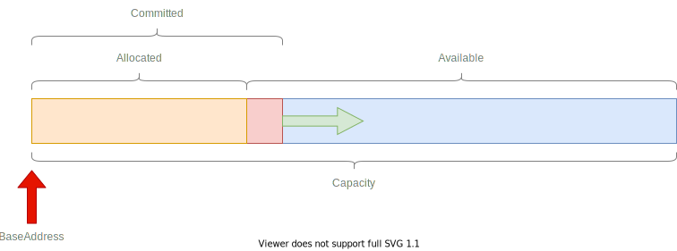

# Varena User Guide

Varena is providing an arena allocator that is relying on virtual memory.

- [Overview](#overview)
- [VirtualArenaManager](#virtualarenamanager)
- [VirtualBuffer](#virtualbuffer)
- [VirtualArray&lt;T&gt;](#virtualarrayt)
- [Common methods](#common-methods)
  - [Allocate with output index](#allocate-with-output-index)
  - [AsSpan](#asspan)
  - [Protect](#protect)
  - [Reset](#reset)
  - [Dispose](#dispose)
- [Advanced](#advanced)

## Overview

With Varena, you can create an arena of 1 TiB, and if you allocate only 100 MiB in it, it will actually take only 100 MiB of actual memory (called "committed" memory).

Still the pointer address to the beginning of the arena will remain stable when you are allocating into the arena.

This is quite different from an allocator that would allocate native memory directly through e.g `malloc` functions, because in that case, it would have to allocate committed memory for the entire capacity of the buffer (so e.g 1 TiB) even if you are only using 100 MiB.

The following diagram shows the different parts of an arena in Varena:



- **Capacity** (`VirtualArena.CapacityInBytes`) = The size in bytes of the memory that has been reserved at creation time (when calling `VirtualArenaManager.CreateBuffer` or `VirtualArenaManager.CreateArray<T>`).
- **Committed** (`VirtualArena.CommittedBytes`) = The size in bytes of the memory that is actually committed, using actual physical memory in your process.
- **Allocated** (`VirtualArena.AllocatedBytes`) = The size in bytes of the memory that has been allocated (via `VirtualBuffer.Allocate` or `VirtualArray<T>.Allocate` methods).
- **Available** (`VirtualArena.AvailableBytes`) = The size in bytes of the memory that is available for allocation, equals to `Capacity - Allocated`
- **BaseAddress** (`VirtualArena.BaseAddress`) = The pointer to the beginning of the arena. This pointer remains stable even if the allocated parts grows.

> **Question**: How is it different from allocating into a `List<T>`?
> 
>  A `List<T>` is using under the hood a managed array `T[]` of a certain capacity to store the "count" elements of the list.
> 
> When you add elements to the list, it will put elements into the array until the array is full. In that case, it will:
> * allocate a new array (usually by doubling the size of the previous array).
> * copy the content of the previous array to the new larger array.
> * place the new element to add into the new array.
> * later, the previous array will have to be collected by the Garbage Collector.
> 
> So for instance, if you reach the capacity of a 100 MiB list, and you want to add an element, it will have to allocate a new array of 200 MiB. This can be very inefficient for such large arrays.
> 
> Instead, in Varena, you can reserve an arena of e.g 500 MiB, even if you are actually going to use only a subset of it. There won't be additional copies performed when you allocate into it and the memory occupied by the arena will be strictly equivalent to what you have allocated in it.

## VirtualArenaManager

The entry point to use Varena is to instantiate a `VirtualArenaManager`. Usually you have a single manager for an application but your requirement may varies.

```csharp
var manager = new VirtualArenaManager();
```

> **WARNING**
> 
> You need to dispose manually the `VirtualArenaManager` (or directly the `VirtualBuffer` or `VirtualArray<T>`) in order to fully free the memory that has been allocated.
> 
> These classes don't implement a finalizer to force the application to control exactly when this memory should be released.

## VirtualBuffer

A virtual buffer is an arena that contains bytes and can be created from the manager.

```csharp
// Creates an arena of capacity of 1 GiB 
var buffer = manager.CreateBuffer("MyArena", 1 << 30);
``` 

The manager will contain the list of all arenas that have been created:

```csharp
// Prints arenas
foreach(var arena in manager.GetArenas()) {
    Console.WriteLine(arena);
}
```

will print something like this:

```
VirtualArena { Name = "MyArena", BaseAddress = 0x000001b020000000, Allocated = 0 B, Committed = 0 B, Available = 1 GiB, Flags = rw- }
```

Let's allocate 1024 bytes into this arena:

```csharp
var span = buffer.AllocateRange(1024);
Console.WriteLine(buffer);
```

And print again the arena:

```
VirtualArena { Name = "Hello", BaseAddress = 0x000001b020000000, Allocated = 1 KiB, Committed = 64 KiB, Available = 1048575 KiB, Flags = rw- }
```

For a capacity of `1 GiB`, the buffer has now the following values:

- Allocated: `1 KiB`
- Committed: `64 KiB`
- Available: `1048575 KiB`

The buffer can be disposed directly:

```csharp
// Dispose the buffer. The arena will be also removed from the manager!
buffer.Dispose();
// manager.GetArenas() will be an empty list.
```

Notice that the buffer will be removed from the manager and the memory will be completely released and freed.

## VirtualArray&lt;T&gt;

A `VirtualArray<T>` is similar to a `VirtualBuffer` but allows to allocate any kind of unmanaged struct data.

```csharp
// Creates an arena of capacity of 1 GiB 
var array = manager.CreateArray<Guid>("MyArena", 1 << 30);
``` 

Allocating into a `VirtualArray<T>` is similar to a `VirtualBuffer`:

```csharp
// Notice that the number passed is the number of elements
// So in that case, we allocate 1024 Guid.
var span = array.AllocateRange(1024);
```

> **WARNING**
> 
> * A `VirtualArenaManager` is thread safe and can be used concurrently from different threads (to create arena/buffers).
> * But `VirtualBuffer` or `VirtualArray<T>` are **not thread-safe** and must be used from a single thread.


## Common methods

A `VirtualBuffer` or `VirtualArray<T>` supports some common methods.

### Allocate with output index

It is convenient to retrieve the offset/index of the element being allocated in a `VirtualArray<T>`:

```csharp
ref var element = ref array.Allocate(out var index);
```

This index can be used to reference the element later:

```csharp
ref var elementNextTime = ref array[index]
```

### AsSpan

An span can be created from an arena by calling the method `AsSpan()`:

```csharp
var span = buffer.AsSpan()
```

it is also possible to take a subset of the arena (index/offset + count):

```csharp
// Create a span of 256 elements starting at element 10
var span = buffer.AsSpan(10, 256)
```

### Protect

You can change the protection flags of a `VirtualBuffer` or `VirtualArray<T>` by calling the `Protect(VirtualMemoryFlags)` method.

By default, arenas are created with the read-write protection (`VirtualMemoryFlags.ReadWrite`).

```csharp
// Makes an arena read-only
buffer.Protect(VirtualMemoryFlags.Read);
// use it for reading...
var x  =buffer[0]
// Revert the read-write
buffer.Protect(VirtualMemoryFlags.ReadWrite);
```

This method changes the protection of the entire committed memory. Using `VirtualMemoryFlags.None` disallow any read or write access to the committed memory.

### Reset

You can reset a `VirtualBuffer` or `VirtualArray<T>` by calling the `Reset()` method:

```csharp
buffer.Reset();
```

This method will make the buffer/array reset to its default: nothing allocated, memory is not taken until it is allocated even if the capacity is e.g 1 TiB.

### Dispose

You can dispose a `VirtualBuffer` or `VirtualArray<T>` by calling the `Dispose()` method:

```csharp
buffer.Dispose();
```

The arena is no longer usable after this method is called. The arena is also removed from its parent `VirtualArenaManager`.

## Advanced

The granularity size of an arena is a multiple of an OS Page Size (`VirtualArenaManager.Handler.PageSize`), usually `4 KiB` on Windows or Linux, but can be different (e.g `16 KiB` on macOS Apple Silicon).

By default, Varena will commit memory by block of `64 KiB`. This value is taken to avoid calling the OS too frequently for committing the memory (so less kernel context switch). So for example, on Windows and Linux, it is committing `16` pages of `4 KiB`. This factor is called the `CommitPageSizeMultiplier`.

The `CommitPageSizeMultiplier` can be configured at two levels:

- At `VirtualArenaManager` creation time: it will be used as the default by all buffers/arrays.
- When creating a `VirtualBuffer` or `VirtualArray<T>`: a specific multiplier can be used for a specific arena.

The capacity of the requested arena must be a multiple of this size (`CommitPageSizeMultiplier * PageSize`) and will be rounded up to it if not.
